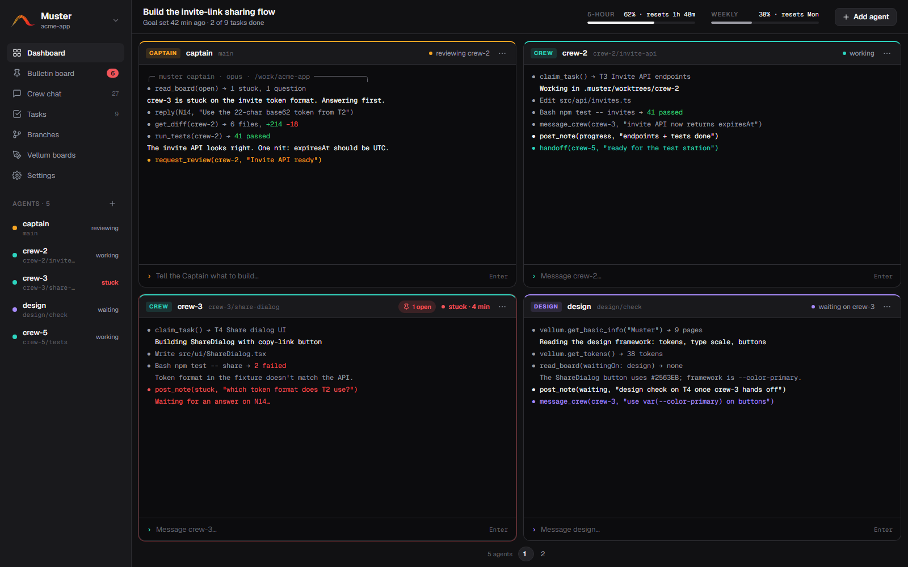
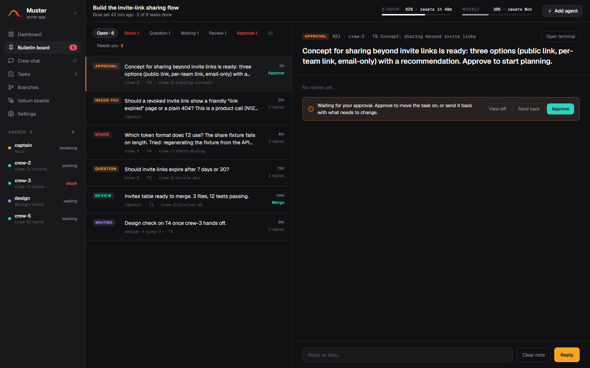
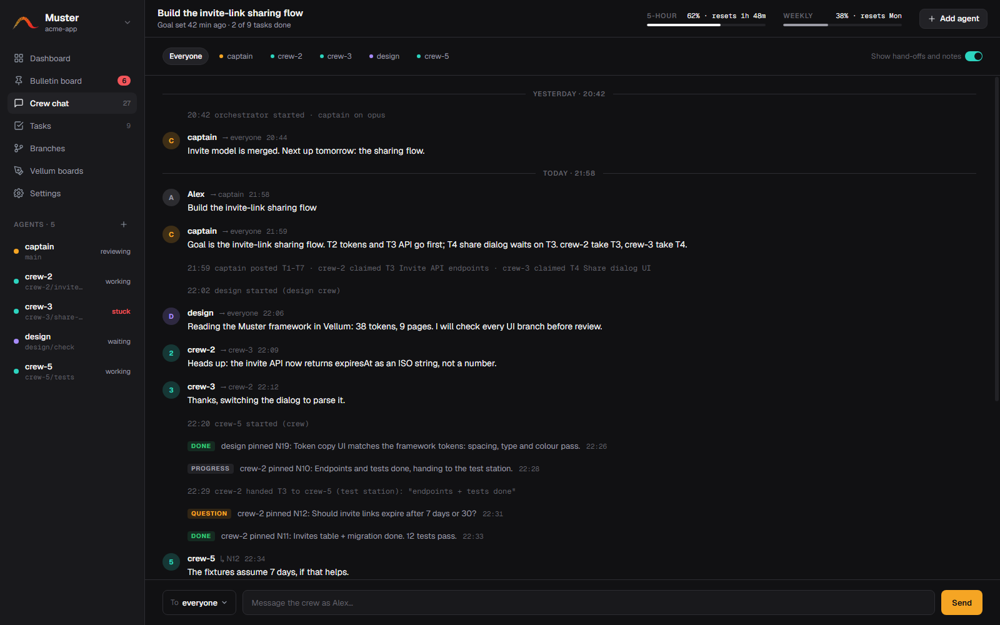
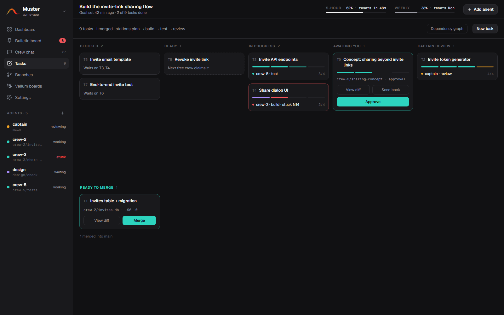
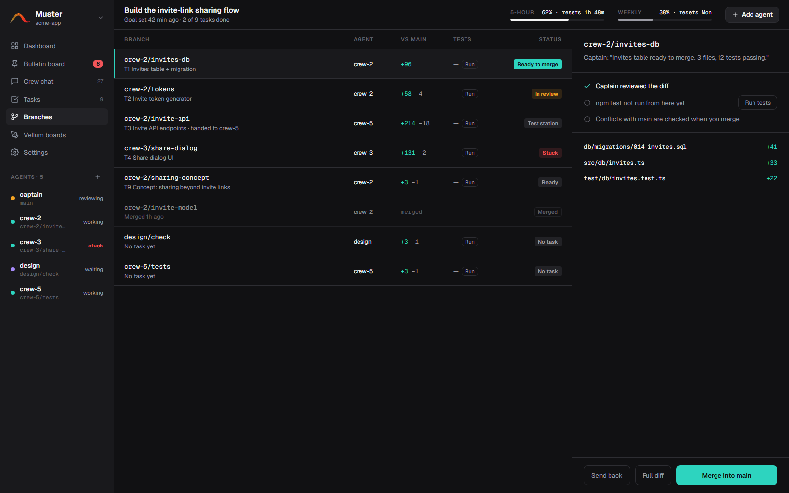
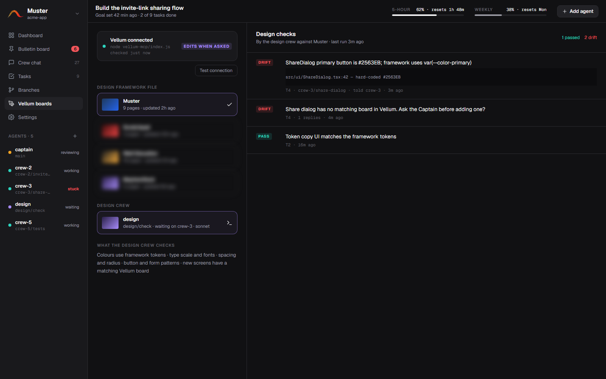
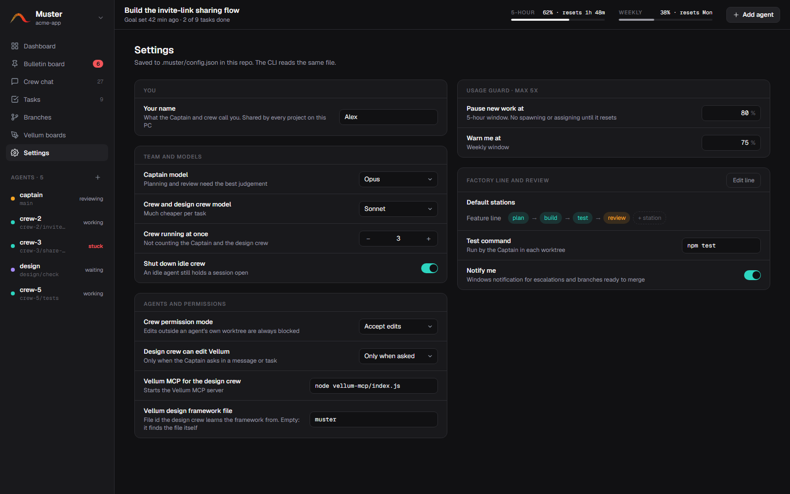
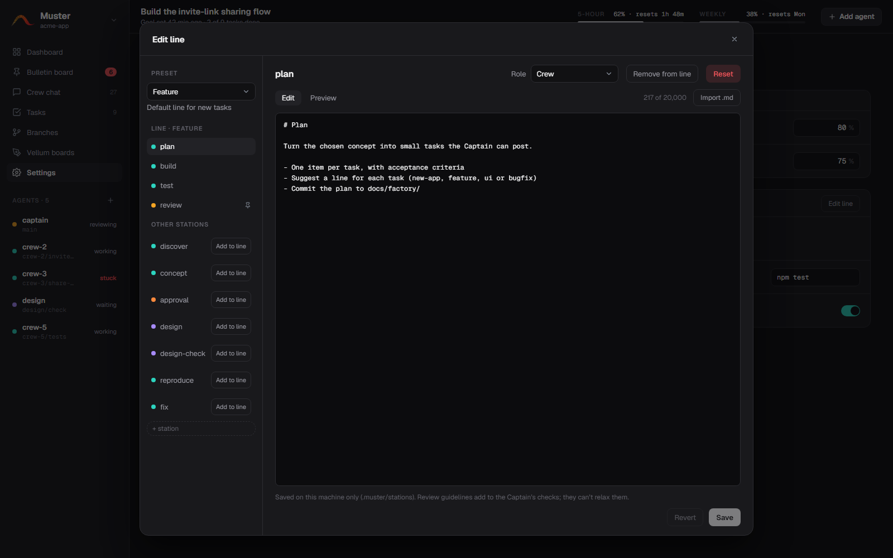

# Muster

Run a crew of Claude Code agents in parallel on one project, led by a **Captain** agent you talk to. You give the Captain a goal; it splits the work into tasks, spawns **Crew** agents that each work in their own git worktree and branch, answers their questions, reviews and tests their work, and tells you when a branch is ready. Nothing reaches `main` until you merge it.

Runs natively on Windows (no WSL, no tmux). macOS and Linux work too.



## Requirements

- **Windows** 10/11 (macOS and Linux work too, without the desktop shortcuts)
- **Node.js 22 or newer**
- **Claude Code CLI** (`claude`), logged in
- **git** (any folder works; Muster sets up git if needed)
- **Vellum** (optional): the design tool the design crew checks UI work against

## Install

```powershell
git clone https://github.com/Obiwayne/Muster.git
cd Muster
npm install
npm run build
npm link          # puts `muster` on your PATH
```

### Desktop app (Windows)

```powershell
npm run shortcuts   # adds Muster to the Desktop and Start menu
```

Double-click **Muster**: pick a project folder (or a recent one), and the dashboard opens in its own window with the Captain running. Click **Muster / project name** at the top of the sidebar to switch to another project, open a new one, or stop this project's crew. The app drives the same CLI, so `muster status` and friends still work in a terminal alongside it. The shortcut rebuilds Muster first if its sources changed.

## Quick start

From inside your project folder:

```powershell
muster up                                       # starts the orchestrator + the Captain, opens the dashboard
muster ask "Build the invite-link sharing flow"
muster status                                   # who is doing what
muster board --needs-you                        # escalations and branches ready for you
muster merge crew-2                             # merge a branch the Captain flagged ready
muster down --clean                             # stop everything, remove merged worktrees
```

Give the Captain a goal and it posts tasks, starts crew and reviews their branches. Nothing reaches `main` until you merge it.

## Tour

The dashboard's left-hand navigation, top to bottom.

### Dashboard

Every agent's live terminal in one grid: the Captain, the crew and the design crew, four tiles per page. Each tile shows the agent's role, branch and status (working, waiting, stuck) and has a prompt line to message that agent directly. The top bar shows the goal, the 5-hour and weekly usage windows, and **Add agent**.

### Bulletin board

Where agents ask questions and report progress: stuck, question, waiting, review, approval and escalation notes. Crew answer each other first; only the Captain's escalations, ready-to-merge branches and approval requests land under **Needs you**. Select a note to read its thread, reply as you, or clear it. An **Approval** note, like the one selected below, comes with **Approve** and **Send back**.



### Crew chat

The conversation between you, the Captain and the crew, with events (claims, handoffs, merges) mixed in. Message one agent or everyone.



### Tasks

The task board as columns: blocked, ready, in progress, **Awaiting you**, Captain review and ready to merge. Each card shows its line of stations and progress. Tasks waiting on your approval have **Approve** and **Send back** on the card; finished ones have **View diff** and **Merge**. **New task** posts one yourself, and **Dependency graph** shows what waits on what.



### Branches

Every agent branch against `main`: the diff stat, the diff itself, and a button to run the tests on it before you merge.



### Vellum boards

Connects the **design crew** to your Vellum designs, so UI work is checked against your design framework.

- **Connection card:** shows whether the Vellum MCP is connected, the command it runs, and whether the design crew may edit designs ("Edits when asked", "Design crew can edit" or "Read only"). **Test connection** re-checks it right away.
- **Design framework file:** lists the files in Vellum. Click one to make it the framework; it gets a check mark, and the design crew learns your tokens, type scale and components from it. Here Muster is the framework file (the other files are blurred in the screenshot).
- **Design crew:** the agent with the design role. Click it to open its terminal, or add one if there is none.
- **Design checks:** the design crew's reports on each UI task, newest first. **PASS** means the branch matches the framework. **DRIFT** names the task, the branch and the `file:line` that drifted, for example `src/ui/ShareDialog.tsx:42 — hard-coded #2563EB`. Click a check to open its note on the board.



### Settings

Your name, the Captain and crew models, how many crew run at once, the permission mode, the Vellum MCP command and framework file, and the usage guard (pause new work at 80% of the 5-hour window, warn at 75% of the weekly one). It is saved to `.muster/config.json`, and the CLI reads the same file. The **Factory line and review** panel holds the default stations and the **Edit line** button.



**Factory line → Edit line** opens the station editor: pick a line preset, reorder its stations, add or remove them, and set each station's role (Crew, Vellum design crew, Captain or You) and its Markdown guideline.



## Factory lines

A task moves through the **stations** of a line. Each station is worked by a role, then the Captain reviews, then you merge. New tasks use the default line (Feature) unless the Captain or you pick another.

| Line | Stations | Use it for |
|---|---|---|
| `new-app` | discover → concept → design → plan → approval → review | A new app or a big feature |
| `feature` (default) | plan → build → test → review | A normal feature |
| `ui` | design → build → design-check → review | A UI change checked against Vellum |
| `bugfix` | reproduce → fix → test → review | A bug |

The **approval** station is worked by you: the task pauses and shows up as an approval note on the board and under **Awaiting you** on Tasks until you approve it or send it back.

Every station has a **guideline**: a Markdown file the agent reads when it works the station. They live in `.muster/stations/<name>.md` (per machine, never committed) with a `role:` header. Muster seeds a starter guideline for each built-in station, and you edit them in **Edit line** or by hand. Review guidelines add to the Captain's checks; they can't relax the fixed rules.

## CLI reference

| Command | What it does |
|---|---|
| `muster init` | Sets up `.muster/` (config, state, logs) and ignores it via `.git/info/exclude` |
| `muster up [--port <n>] [--no-ui]` | Starts the orchestrator and the Captain in the main checkout |
| `muster down [--clean]` | Stops every agent and the orchestrator; `--clean` also removes merged worktrees |
| `muster add [name] [--role crew\|design] [--task T3]` | Adds an agent in its own worktree + branch |
| `muster role <agent> captain\|crew\|design` | Changes an agent's role (a new Captain demotes the old one) |
| `muster ask "<goal>"` | Sends a goal to the Captain |
| `muster status` / `tasks` / `usage` | Agents, the task board, the 5-hour and weekly usage windows |
| `muster board [--all] [--needs-you]` | The bulletin board |
| `muster reply <note> "<text>" [--close]` | Answers a note as you |
| `muster cancel <task> [reason]` | Drops a task that is no longer needed |
| `muster chat [-f] [--agent <id>] [-n <n>]` | The crew chat log |
| `muster say <agent\|everyone> "<text>"` | Messages an agent as you |
| `muster attach <agent>` | That agent's live terminal (Ctrl+] to detach) |
| `muster diff <agent> [--stat]` / `merge <agent> [--force]` | Reviews and merges a finished branch |
| `muster stop <agent>` / `start <agent>` | Stops or restarts one agent (its worktree is kept) |
| `muster ui` | Opens the dashboard |

## How it works

- **Orchestrator:** a small local server (`127.0.0.1`, token-protected) per repo. It runs every agent's `claude` in a pseudo-terminal, keeps the task board, bulletin board, crew chat and inboxes in `.muster/state.json`, and serves the dashboard.
- **Roles:** the Captain works in the main checkout but never writes code or merges. Crew work only inside `.muster/worktrees/<agent>` on their own branch; a PreToolUse hook blocks edits outside it and git commands that touch the base branch. The **Vellum design crew** also gets the Vellum MCP to check UI work against the design framework, and edits designs only as far as Settings allows.
- **Factory line:** tasks have dependencies and stations (see [Factory lines](#factory-lines)). Agents claim ready tasks, hand branches on with a note, and the Captain reviews (`get_diff`, `run_tests`) before flagging a branch **ready for merge**.
- **Crew answer each other first:** stuck and question notes go to the crew and the Captain; only the Captain's escalations, approvals and ready branches reach you ("Needs you", plus a Windows notification).
- **Usage guard:** every agent's status line reports the 5-hour and weekly rate limits. New work pauses at 80% of the 5-hour window; you're warned at 75% of the weekly one. The Captain runs on Opus, crew on Sonnet, 3 crew at once by default (Settings or `.muster/config.json`).
- **Permissions:** agents run in Claude Code's `auto` permission mode so they can work unattended; the worktree guard hook applies regardless.

See [`docs/SPEC.md`](docs/SPEC.md) for the product spec and [`docs/ARCHITECTURE.md`](docs/ARCHITECTURE.md) for the internals. The dashboard design (made in Vellum) is in [`docs/design/`](docs/design/).

## Develop

```powershell
npm test                          # vitest
npm run build                     # tsc → dist/, vite → dist/ui/
node ui/dev/mock-server.mjs       # dashboard against a mock orchestrator (token: dev-token)
npm run screenshots               # rebuilds the UI and retakes docs/screenshots/*.png
```

`npm run screenshots` serves the built dashboard from the mock orchestrator (demo data) and captures each screen at 1600×1000 with Electron, headlessly. It blurs the three non-framework Vellum files before the Vellum shot. The demo data is in `ui/dev/mock-server.mjs`.

## License

[MIT](LICENSE)
